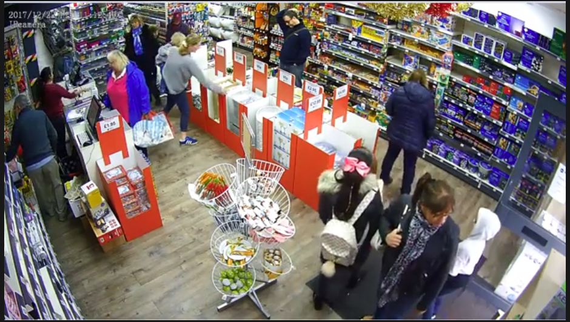
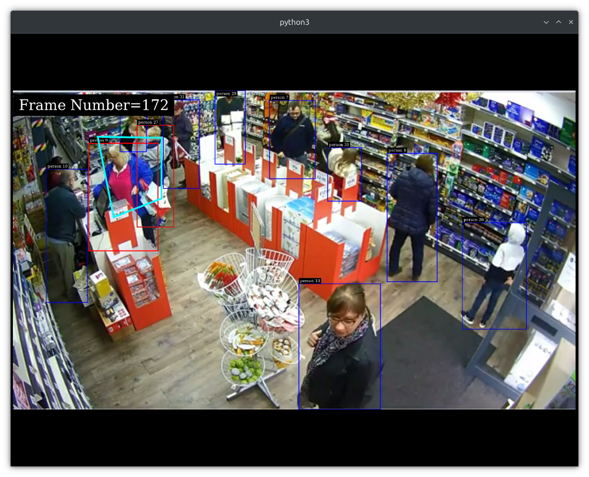

# RTSP Multi QSR Retail ROI
## Images

The following images are included in the project:

### Input Image
  
*Sample input image for testing the pipeline.*

### Output Image
  
*The output image after processing, showing the results of the analysis.*

## Overview

This project implements a system for analyzing wait times in retail environments using multiple RTSP camera feeds. The system processes video streams to identify regions of interest (ROIs) and calculates wait times based on customer behavior. The project leverages deep learning models for object detection and tracking.

## Project Structure

```
RTSP_Multi_QSR_Retail_ROI/
│
├── experiment.py                 # Main script for processing video streams and analyzing wait times
├── get_frame.py                  # Utility script to extract frames from video
├── dtset2_pgie_config.txt        # Configuration file for the primary GIE (GPU Inference Engine)
└── images/                       # Folder containing input and output images
    ├── input.png                # Sample input image
    └── output.png               # Sample output image
```

## Pipeline

The pipeline consists of the following steps:

1. **Video Capture**: The system captures video streams from multiple RTSP sources.
2. **Frame Extraction**: The `get_frame.py` script is used to extract frames from the video streams at specified intervals. This is crucial for processing specific regions of interest (ROIs) in the video.
3. **ROI Processing**: The extracted frames are processed to identify and track customers within the defined ROIs.
4. **Wait Time Calculation**: The system calculates the wait times based on the detected customer behavior in the ROIs.
5. **Output Generation**: The results are saved and can be visualized in the output images.

## Models

The project uses the following models:

- **TrafficCamNet**: A pre-trained model for detecting objects in retail environments. The model is specified in the configuration file (`dtset2_pgie_config.txt`) and is loaded during the inference process.
- **ONNX Model**: The model is provided in ONNX format, which is optimized for inference on NVIDIA GPUs.

### Configuration File

The configuration file (`dtset2_pgie_config.txt`) contains essential parameters for the model, including:

- `gpu-id`: Specifies the GPU to be used.
- `onnx-file`: Path to the ONNX model file.
- `model-engine-file`: Path to the compiled engine file for the model.
- `num-detected-classes`: Number of classes the model can detect (in this case, relevant objects in the retail environment).
- `infer-dims`: Input dimensions for the model.

## Frame Extraction

The `get_frame.py` script is responsible for extracting frames from the video stream. It captures frames at specified intervals (every 15 frames in this case) and resizes them to 1920x1080 pixels. The coordinates of the ROIs are determined during this process, allowing for focused analysis on specific areas of the frame.

### Usage

To run the project, ensure you have the necessary dependencies installed and the DeepStream SDK set up. Then, execute the `experiment.py` script to start processing the video streams.

```
python experiment.py
```


## License

This project is licensed under the Apache License, Version 2.0. See the LICENSE file for more details.

